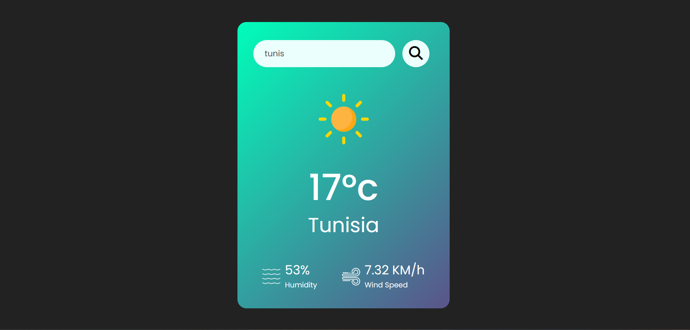

# Weather App

## Overview


Weather app allows users to check the weather for any of their favorite cities. All cities that are saved to Core Data will be listed on the initial view controller.

This app uses the openweathermap API to search for a city name as well as OpenWeatherMap API to access current weather data for selected cities. Weather App was completed as an assignment for Seneca College course in iOS Mobile Application Development by using fundamental principles as follows:

* Dependency Injection & Singleton Desing Pattern
* UISearchBar
* Network Request, API & Web Services
* Core Data & Persistence


Language:HTML5, CSS, JavaScript 
## Resources

Weather API: <https://openweathermap.org/api>


## Setup

You need to replace you unique API Key for OpenWeatherMap API in the following static property . 
```


